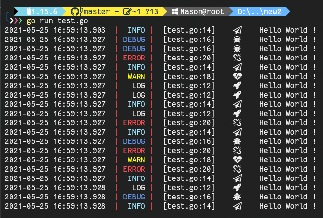

# goConsole  
模仿Node控制台Console(美化)  
作者学go没多久,有更好~~~~的方法来美化可以联系我 [MasonShi@88.com](mailto:MasonShi@88.com)

## 食用例程
```go
package main

import "github.com/Mas0nShi/goConsole/console"

func main()  {

	console.Log("Hello World !")
	console.Debug("Hello World !")
	console.Info("Hello World !")
	console.Warn("Hello World !")
	console.Error("Hello World !")
}
```

## 预览

